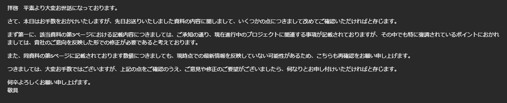
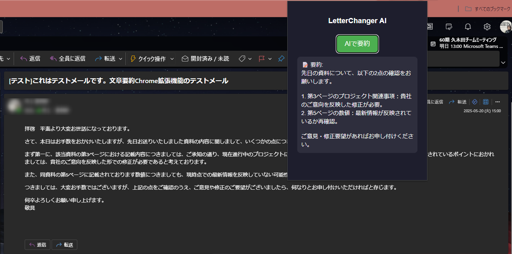

# SmartLetterAI

SmartLetterAI は、AIを利用してOutlookメールの本文を要約できるChrome拡張機能です。  

## 特長

- メールや本文をAIが要約
- 文体のカスタマイズ（丁寧・フレンドリー など）  
  ※プロンプトの修正が必要

## スクリーンショット

| 元画面 | 要約結果画面 |
|------------------|--------------|
|  |  |

## インストール方法

1. このリポジトリをクローンまたはダウンロード
2. Chrome で `chrome://extensions/` にアクセス
3. 「デベロッパーモード」をオンにする
4. 「パッケージ化されていない拡張機能を読み込む」→ 本プロジェクトのルートフォルダを選択

## 使い方

1. 拡張機能のアイコンをクリック
2. ポップアップ上の「AIで要約」ボタンをクリック
3. ポップアップ画面で要約された文を確認
   
※background.js :1行目にGeminiのAPIキーを記載する必要があります。
GeminiのAPIキーは、以下から取得できます。
`https://ai.google.dev/gemini-api/docs?hl=ja`

## 技術構成

- **Manifest Version**: 3
- **フロントエンド**: HTML / CSS / JavaScript
- **AI連携**: Gemini API

## 開発者向け

- `manifest.json` に拡張機能の設定
- `background.js`：AIとの非同期通信
- `popup.html` / `popup.js`：ポップアップUIと処理ロジック

## 今後の予定

- オン/オフ切り替え機能
- 特定のユーザにだけ要約機能を適用
- 要約結果の保存機能
- 要約結果をメール本文として書き換える機能
